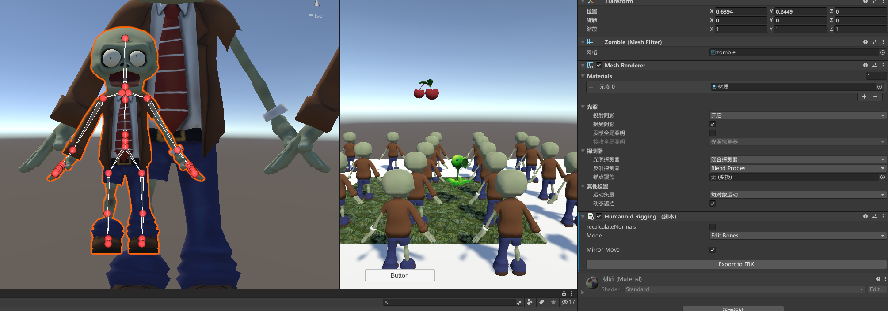
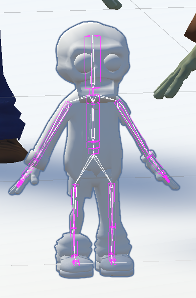
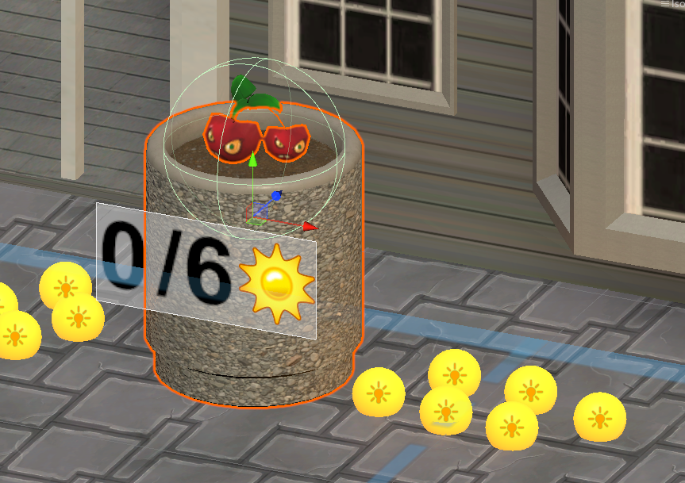
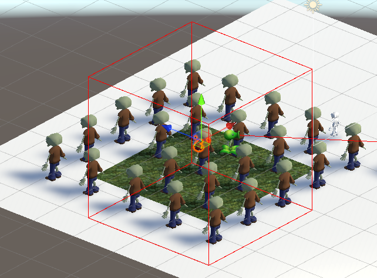
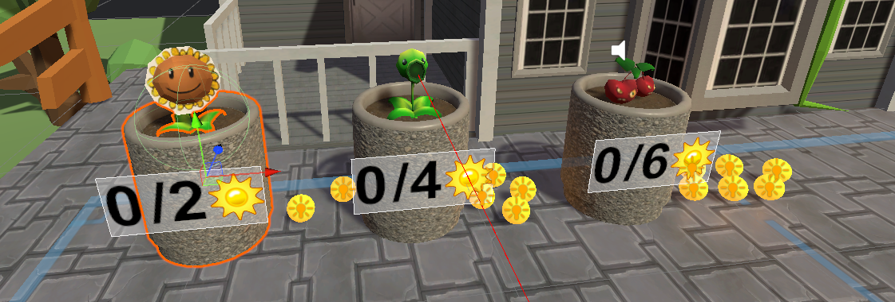

# 植物大战僵尸VR版

This is a VR mini-game based on Unity and SteamVR, and it is also a personal project for my virtual reality course \
这个是基于Unity和SteamVR制作的VR小游戏，也是我虚拟现实课程的个人大作业

# 项目时间
2024年4月 - 2024年6月

# 实机演示


# 相关技术支持

开发平台：Unity3D引擎 \
VR硬件设备：Pico4 \
VR软件部分：pico互联 \
插件部分：steamVR2.8.0和humanoid rigging

# 整体系统效果实现
将经典的2D塔防游戏《植物大战僵尸》转化为沉浸式的虚拟现实体验。通过Unity3D、 Pico4 VR将戴夫的后院以及各种植物和僵尸带入了三维空间。在VR环境中，玩家能够以第一人称视角体验游戏，使用VR控制器模拟戴夫的双手，进行植物的种植、收集阳光、攻击僵尸等操作。优化了手部模型的交互细节，使用了humanoid rigging插件来进行骨骼绑定，还使用了原版《植物大战僵尸》的经典音效和音乐，进行原汁原味的风格。

# 图片展示
  
  
  
  
  
