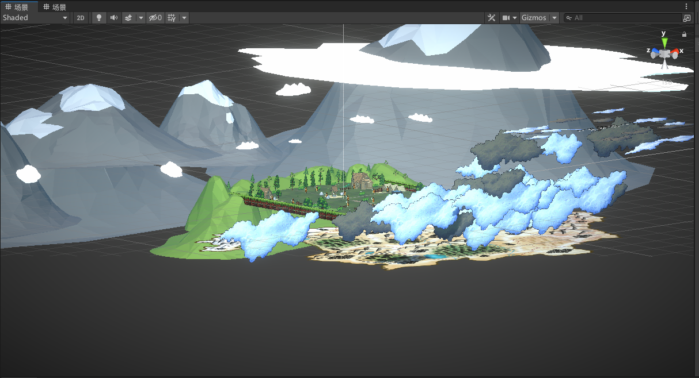
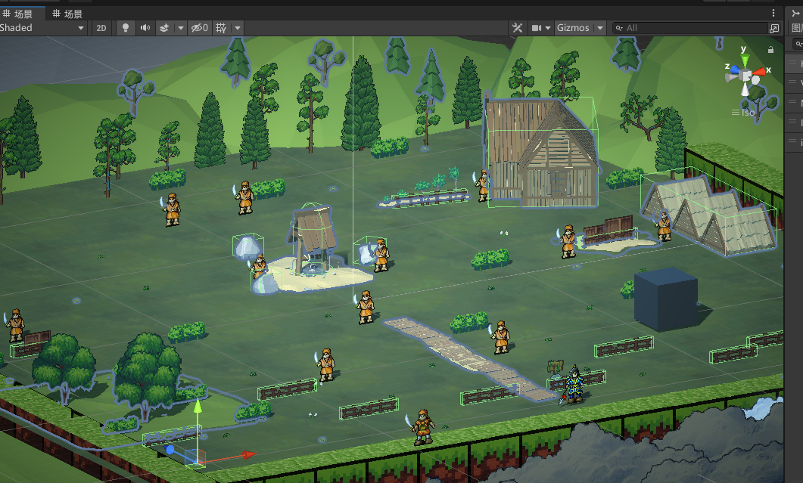
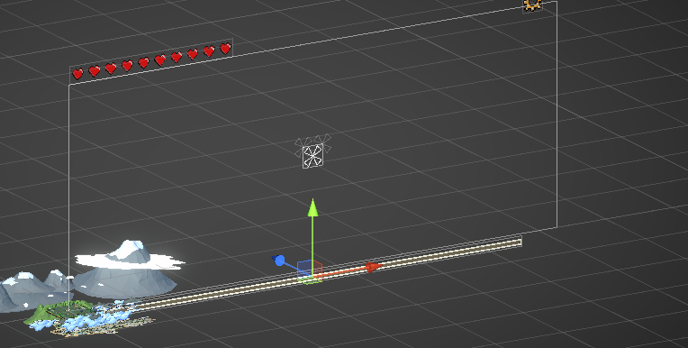
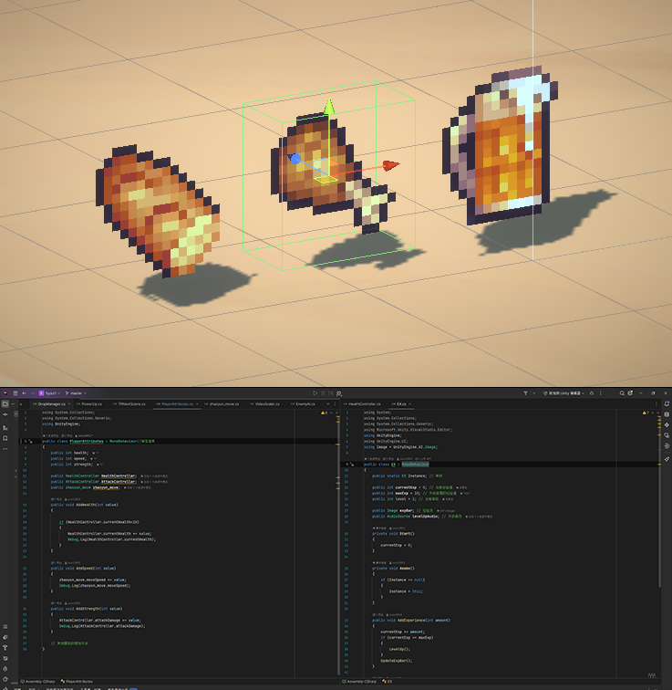
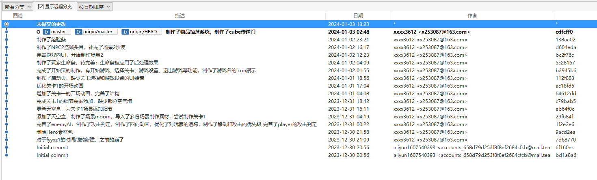

# Unity游戏开发项目

Gained primary experience with Unity in the Foundations of Game Design course, developed a 2.5D pixel game, and simulated HD-2D style, covering the complete game development process  Implemented features such as user registration and back-end database integration, and uploaded the game to itch.io successfully \
在游戏设计基础课程中获得了Unity的初步经验，开发了一款2.5D像素游戏，模拟了HD-2D风格，涵盖了完整的游戏开发过程，并且发布itch.io成功

# 项目时间
2023年10月 - 2023年12月

# 实机演示


# 相关技术支持

开发平台：Unity3D引擎 \
开发语言：C# \
版本控制：Git

# 整体系统效果实现
这是一款闯关类的RPG游戏，规则为在闯关杀怪中提升自己的实力，通过关卡，风格采用了HD-2D的画风，制作了景深等相关后处理，将2d像素风和3d卡通风相结合制作而成的像素游戏。

# 图片展示
  
  
  
  
 