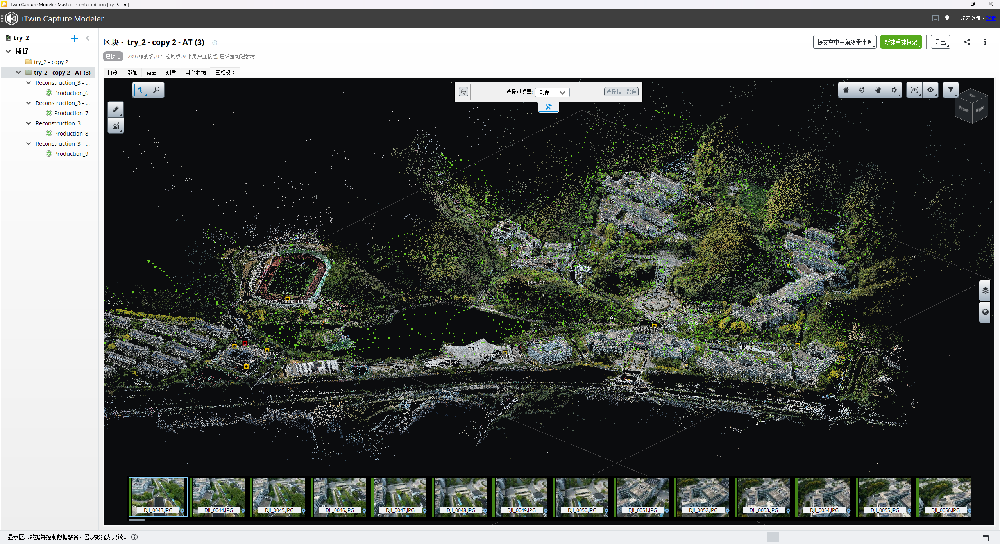
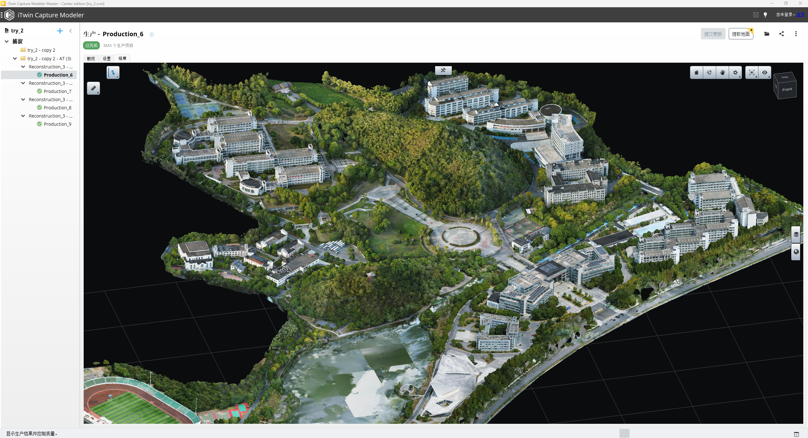
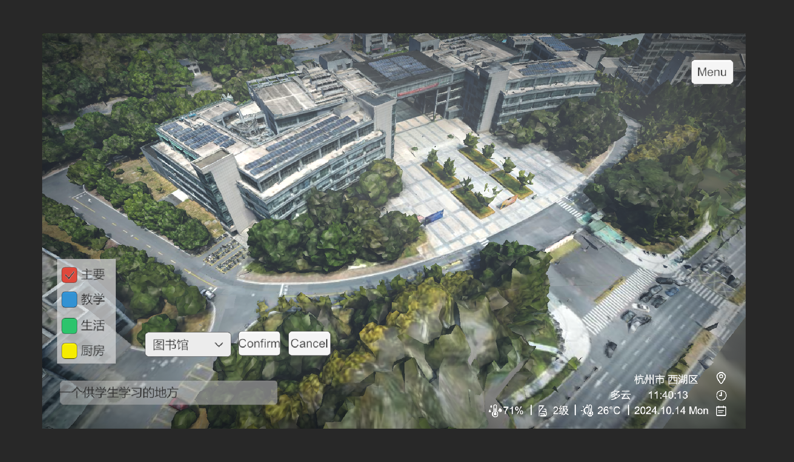
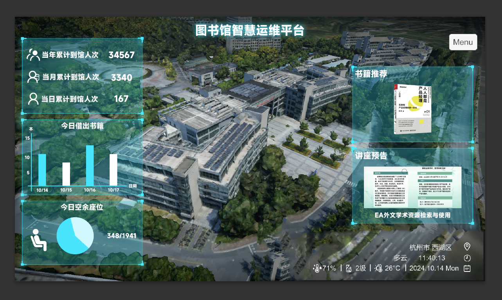
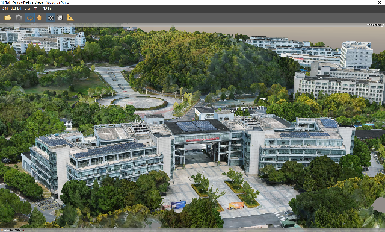

# 虚拟校园
This experiment is based on the background of the vigorous promotion of smart campus construction. By using the oblique photography technology of unmanned aerial vehicles (UAVs) and the Unity3D engine, a 1:1 three-dimensional modeling and navigation system of the campus environment has been achieved. Through the DJI Mavic 3 UAV, about 4,000 images of the campus were collected. The iTwin Capture software was used to conduct three-dimensional reconstruction and fine-tuning of the entire campus area, and the 3mx format file was exported. In the Unity engine, the LOD technology was optimized by using the 3mx format open-source program to achieve functions such as 3D model rendering of buildings, classification of navigation tags, switching between day and night and weather, and real terrain mapping. Combined with the concept of digital twins, a highly interactive campus navigation system was created. \
本次实验基于智慧校园建设大力推广的时代背景，利用无人机倾斜摄影技术和Unity3D引擎，实现了校园环境的1:1三维建模与导览系统构建。通过DJIMavic3无人机采集校园影像数据（约4000张），运用iTwin Capture软件对整体校园区域进行三维重建和精细化修整，导出3mx格式文件。在Unity引擎中，使用3mx格式开源程序实现了LOD技术优化模型渲染，完成建筑3D模型渲染、导航标签分类、昼夜与天气切换、真实地形映射等功能。结合数字孪生理念，打造了一个高度交互的校园导览系统。

# 项目时间
2024年9月 - 2024年12月

# 实机演示


# 相关技术支持
- 模型制作
无人机硬件：DJI mavic3 \
三维重建平台：iTwin Capture（ContextCapture） \
辅助软件：图新地球4 \
- 程序设计
开发平台：Unity3D引擎 \
辅助软件：图新地球4、QGIS Desktop 3.34.11、Global Mapper14 \
开源项目：[Unity-3mx](https://github.com/ProjSEED/Unity-3mx) [off-screen-indicator](https://github.com/jinincarnate/off-screen-indicator) [UniStorm](https://assetstore.unity.com/packages/tools/particles-effects/unistorm-volumetric-clouds-sky-modular-weather-and-cloud-shadows-2714)

# 整体系统效果实现
通过无人机对校园区域及周边地区进行倾斜摄影，通过三维重建的软件对影像的姿态元数据进行计算得到三维测量数据，在软件中进行空中三角量测量生成自动连接点，根据自动连接点、用户连接点和几何约束结合计算得到初步的三维重建模型，对于模型进行后期修整优化，保证模型完整，最后进行拼接，得到一个完整的校园模型文件。倾斜摄影技术完成三维重建后可以对校园环境进行全景化、虚拟化的展示，实现对物理校园的真实还原。在数字建模中，对校园环境、道路、建筑、设施等进行1:1的仿真，形成真实校园的数字建模，也就是数字孪生体。这个数字孪生体能够准确反映真实校园的运行状态。
在unity游戏引擎中使用Unity-3mx文件实现对于模型施展LOD（Levels of Detail）技术来减缓电脑运行压力，LOD技术指根据物体模型的节点在显示环境中所处的位置和重要度，决定物体渲染的资源分配，降低非重要物体的面数和细节度，从而获得高效率的渲染运算。并在unity引擎中制作建筑指引，相关ui等界面设计的相关内容。
为了增强校园导览系统的真实感，可以通过网络获取校园周边的卫星图像和高精度的高度图，将两者结合使用在Unity中生成真实的地形模型。从"天地图"获取校园周边的卫星图，从NASA Earthdata下载高精度的地形高程数据。获取这些数据后，可以在Unity中利用Terrain工具导入和处理这些图像，生成三维地形。

# 图片展示
   
  
   
  
   