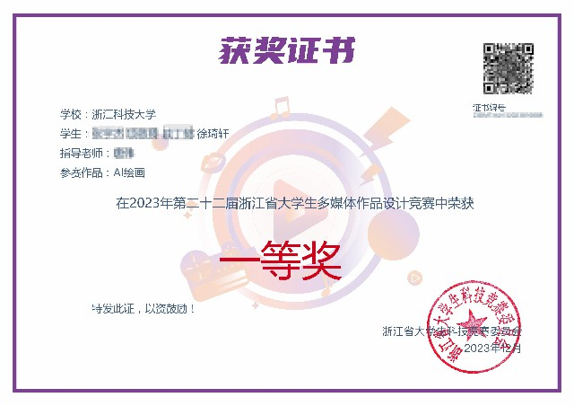

# 项目介绍

An interactive courseware is designed to popularize the principle of AI painting and the installation and use of Stable Diffusion \
设计了一个交互式课件，目的是在ai火热的当下，普及AI绘画的原理和Stable Diffusion的安装和使用

# 项目时间
2023年10月 - 2023年12月

# 实机演示


# 整体系统效果实现
这是一个集教育、展示和交互于一体的AI绘画教学系统，通过图文并茂的方式向用户介绍AI绘画的基本概念、工作原理和实际应用。系统采用现代前端技术栈构建，提供了直观易懂的界面和流畅的用户体验，帮助用户系统性地学习和理解AI绘画技术。
系统不仅展示了AI绘画的基础理论，还通过实际案例展示了AI绘画在艺术创作、建筑设计等领域的应用，体现了AI技术与传统创作领域的结合与创新。

# 奖状
 